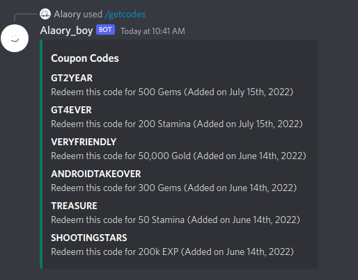
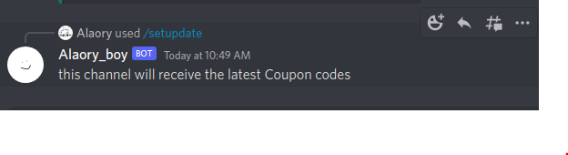

#       GURADRIAN TALES DISCORD BOT
>       UNDER DEVELOPMENT ONLY FOR LINUX


[](https://github.com/Alaory)


## Commands
/getcodes

will send the last 6 coupon codes from database. the number can be changed

</br>
/setupdate



whenever the the scraper finds a new coupon code it will send it to this channel

</br>
/register

* need to be fixed

will automaticly redeem the new codes
for the users who have been added to the list via this command


</br>

#### more comming 

</br>

TODO LIST:

- [x] add discord SlashCommands :smirk:
- [x] add cron function for automatic coupon checker :fearful:
- [x] add slashcommand for user id and name
- [x] compine sotrage files togther
- [x] add auto Coupon Redeemer  :bowtie: //too slow need to find other way to do it
- [x] fix the Web Scraper 
- [ ] fix and clean the repo :flushed: //on hold
- [ ] add arena stuff :satisfied:
- [ ] setup redeem code
- [ ] <strong>OPTIONAL</strong> add news and best charater selector :smile:
- [ ] add support for windows


TO BUILD:
```
git clone https://github.com/Alaory/guardian-tales-discord-bot
cd guardian-tales-discord-bot
mkdir build && cd build
cmake .. -DTOKEN=your discord bot token
make
```
<strong>IMPORTANT</strong><br>
you need a firebase google-services.json file. drop it in the build folder
and change the link from the database.hpp file to your files links and
<strong>dont forget to add the files to storage on the firebase</strong>

if you dont want to use the firebase stuff tell me and i'll make a branch with out the firebase and replace it with local files

thanks to:

    - firebase "Apache License 2.0"
    - DPP "Apache License 2.0"
    - httplib "MIT license"
    - myhtml "LGPL-2.1 license"
    - nlohmann/json "MIT license"
    - Bosma/Scheduler "MIT license"

for the librays
